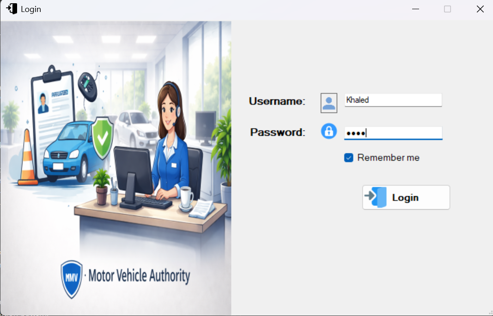
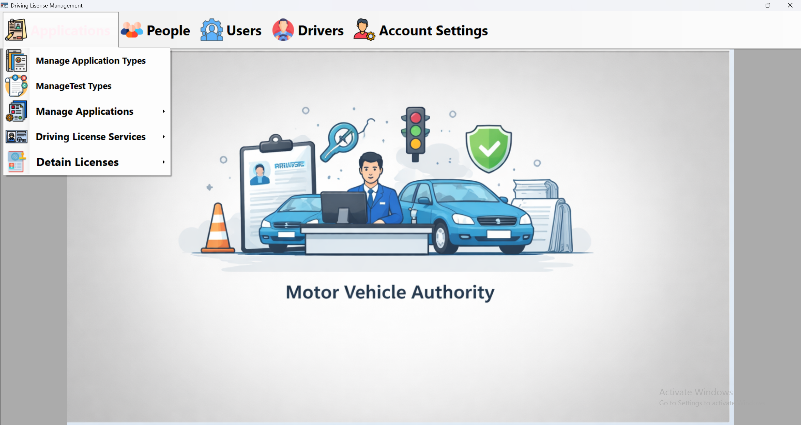
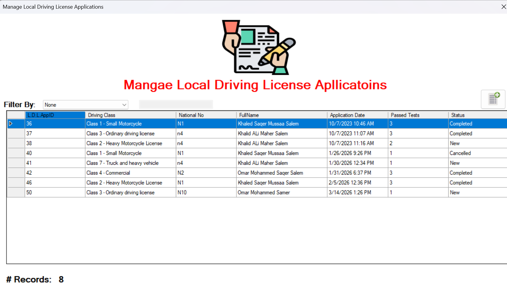

# Driving License Management System

A desktop application that simulates the workflow of a driving license management system.  
The system allows managing applicants, issuing and renewing licenses, and handling different types of tests required for an applicant to obtain a driving license through an easy-to-use UI.

## Key Features

- 3-tier architecture designed for scalability and maintainability
- Add and manage different types of applicants
- Issue new local or international driving licenses
- Renew existing licenses
- Search and update records
- Delete applicant or license data

## Tech Stack

- Language: C#
- Framework: .NET / Windows Forms / ADO.NET
- Database: SQL Server
- Tools: Visual Studio, Git, GitHub

## What I Learned

Through this project, I improved my understanding of:

- Building real-world applications beyond simple demos
- Debugging applications and tracing errors effectively
- Desktop application development
- Implementing CRUD operations and database connectivity through code
- Designing databases and integrating them with SQL Server
- Layered architecture and writing clean, maintainable code

## Things to Improve in the Future

- Add security features (e.g., password hashing)
- Implement a permissions and roles system for users

## How to Run the App

1. Clone the repository to your local machine
2. Set up the database by either:
   - Running the `database.sql` script, or
   - Restoring the `DVLD.bak` backup file in your database system
3. Open the solution file (`DVLD.sln`) located in the Presentation folder using Visual Studio
4. Update the connection string in the `App.config` file inside the Presentation folder to match your local database settings
5. Run the application

### Default Login (for testing)

- Username: Khaled
- Password: 1234

## Note

The main functionalities of the system work as expected, but the project was not fully tested in all edge cases. If you encounter any issues, feel free to let me know so I can fix them.

- I am aware this is an older technology, but I chose it because it provides a simple graphical interface instead of a console-based application.
- I am currently focusing on web development, but I'm sure that the experience gained from building this project will benefit me in my Web journey.

## Screenshots

### Login Screen

### Main Screen

### License Management

